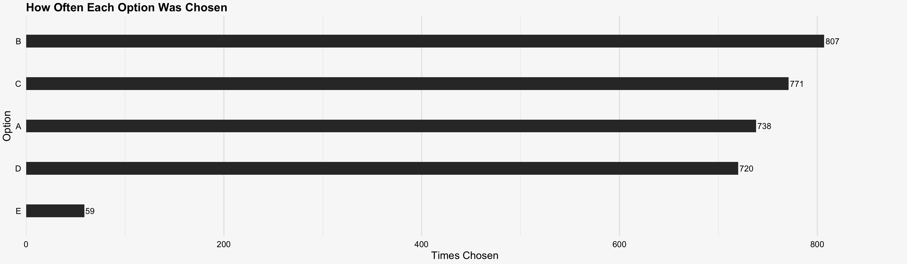
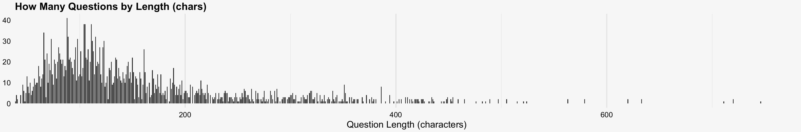

This horizontal bar chart shows how often each answer option was correct. Option B was right most frequently (807 times), followed closely by C (771), A (738), and D (720)—all within roughly the same range—while option E lags far behind at just 59 selections. This sharp drop‐off for E suggests that very few questions offered a fifth choice. The relative parity among A–D indicates there isn’t a strong overall bias toward any single one of those four positions, but the near‐absence of E reveals an uneven distribution of answer slots in the quiz design.

