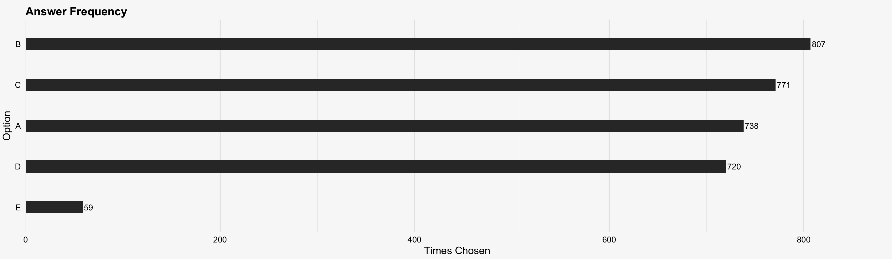

## SLCC IT Associate Degree Data analytics

This repository contains canvas/ccna data from the IT Associate’s Degree program at South Louisiana Community College. It includes quiz questions, answer choices, and multiple import formats to integration with various learning platforms. In addition, provided data visualizations to help you understand answer distributions, question lengths, and other quiz metrics.

### Format Options
- **CSV** - Simply 2 column layout (quetsion and answer)
- **GoogleForms** - CSV layout sutable for google form import (Need [Form Builder](https://workspace.google.com/marketplace/app/form_builder/133781775166) Plugin)
- **Quizlet** - Txt file with `|` delimited question and answers for import into Quizlet.com
- **Kahoot** - XLSX layout sutable for kayhoot.com import (most sets are to large)
- **Quizziz** - XLSX layout sutable for quizziz.com import with photos
- **Rds** - Raw r data objects for use if programming

## Conclusions
This horizontal bar chart shows how often each answer option was correct. Option B was right most frequently, followed closely by C, A, and D —all within roughly the same range—while option E lags far behind. This sharp drop‐off for E suggests that very few questions offered a fifth choice. The relative parity among A–D indicates there isn’t a strong overall bias toward any single one of those four positions, but the near‐absence of E reveals an uneven distribution of answer slots in the quiz design.

